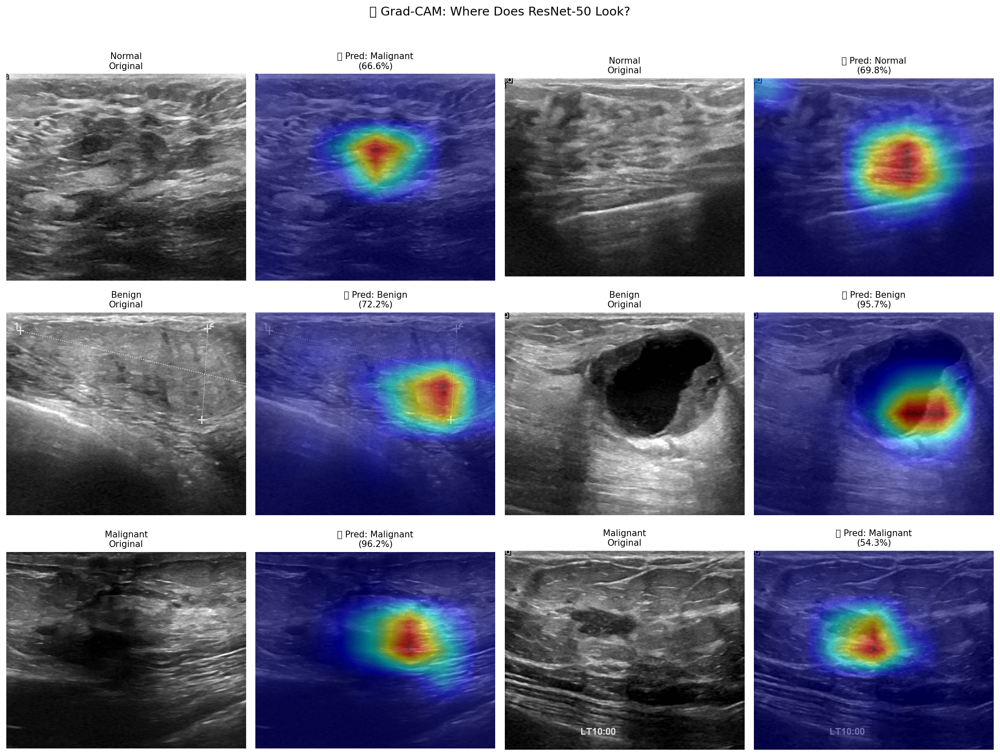
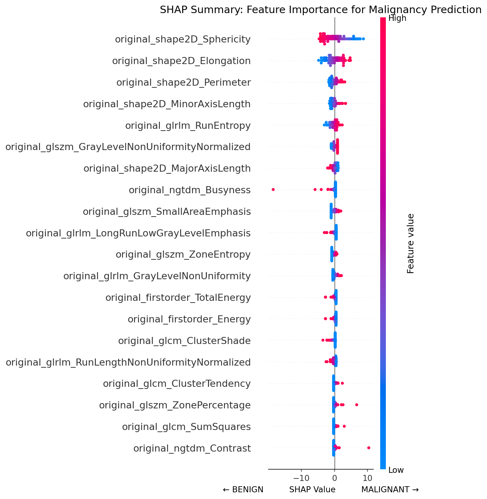
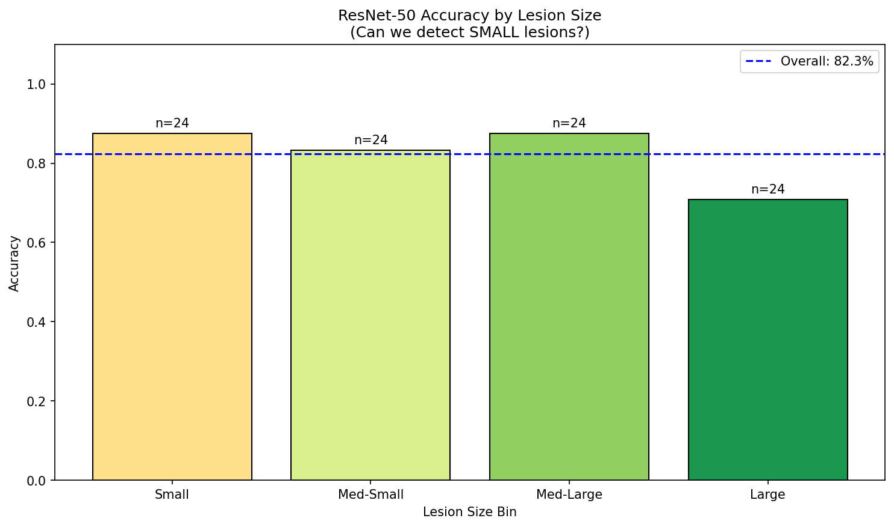

# AMEEMAW 🩺💜

**AI Mamma-Echography Educator & Empathetic Mentor for Awareness & Wellness**

A breast ultrasound classification tool with explainable AI and GenAI-powered patient communication.


---

## 🎯 Project Overview

AMEEMAW is an educational and supportive AI tool designed to:
1. Classify breast ultrasound images (Normal / Benign / Malignant)
2. Provide explainable predictions using Grad-CAM and SHAP
3. Offer empathetic, patient-friendly explanations through **Nana**, an AI companion

### Two Modes

| Mode | Purpose | Features |
|------|---------|----------|
| **Learn Mode** | Educational | Upload image → Guess → AI reveals prediction + Grad-CAM + explanation |
| **Explain Mode** | Emotional Support | Input BI-RADS result → Nana explains in plain language + next steps |

---

## 📊 Dataset

**Breast Ultrasound Images Dataset (BUSI)**
- **Source**: [Kaggle](https://www.kaggle.com/datasets/aryashah2k/breast-ultrasound-images-dataset)
- **Original Paper**: [Al-Dhabyani et al. (2020)](https://www.sciencedirect.com/science/article/pii/S2352340919312181)
- **License**: CC BY 4.0
- **Size**: 780 images
- **Classes**: Normal (133), Benign (437), Malignant (210)
- **Format**: PNG grayscale images with corresponding masks

---

## 📈 Results

### 🏆 Full Model Comparison (15 Models!)

| Rank | Model | Type | Accuracy | Precision | Recall | F1 Score | AUC-ROC |
|------|-------|------|----------|-----------|--------|----------|---------|
| 1 | Logistic Regression | Tabular (2-class) | 93.75% | 94.27% | 93.75% | 93.54% | 0.952 |
| 2 | XGBoost | Tabular (2-class) | 93.75% | 94.27% | 93.75% | 93.54% | 0.984 |
| 3 | ResNet-50 | CNN (2-class) | 89.69% | 90.32% | 89.69% | 89.84% | 0.959 |
| 4 | MLP | Tabular (2-class) | 88.54% | 88.50% | 88.54% | 88.23% | 0.897 |
| 5 | EfficientNet-B0 | CNN (2-class) | 87.63% | 87.91% | 87.63% | 87.73% | 0.954 |
| 6 | VGG-16 | CNN (2-class) | 86.60% | 86.73% | 86.60% | 86.65% | 0.949 |
| 7 | MobileNetV2 | CNN (2-class) | 85.57% | 85.57% | 85.57% | 85.57% | 0.949 |
| 8 | **ResNet-50** | **CNN (3-class)** | **84.62%** | **86.11%** | **84.62%** | **84.86%** | **0.953** |
| 9 | EfficientNet-B0 | CNN (3-class) | 82.91% | 86.32% | 82.91% | 83.42% | 0.937 |
| 10 | Random Forest | Tabular (2-class) | 83.33% | 82.97% | 83.33% | 82.98% | 0.890 |
| 11 | SVM (RBF) | Tabular (2-class) | 82.29% | 85.92% | 82.29% | 79.80% | 0.956 |
| 12 | VGG-16 | CNN (3-class) | 77.78% | 80.39% | 77.78% | 78.11% | 0.920 |
| 13 | Custom-CNN | CNN (2-class) | 77.32% | 80.24% | 77.32% | 77.97% | 0.857 |
| 14 | MobileNetV2 | CNN (3-class) | 77.78% | 81.05% | 77.78% | 77.89% | 0.939 |
| 15 | Custom-CNN | CNN (3-class) | 27.35% | 12.21% | 27.35% | 16.82% | 0.668 |

### 🚀 Deployment Model: ResNet-50 (3-Class)

| Metric | Value |
|--------|-------|
| Overall Accuracy | 84.6% |
| Normal Precision | 79.2% |
| Normal Recall | **95.0%** |
| Benign Precision | 94.7% |
| Benign Recall | 81.8% |
| Malignant Precision | 72.2% |
| Malignant Recall | 83.9% |

### 📊 Key Insights

- 🥇 **Best Overall**: Logistic Regression (Tabular) — F1: 93.54%
- 🖼️ **Best CNN (3-class)**: ResNet-50 — F1: 84.86%
- 🖼️ **Best CNN (2-class)**: ResNet-50 — F1: 89.84%
- 📊 **Best Tabular**: Logistic Regression — F1: 93.54%
- 💡 Tabular (radiomics) beats CNNs by ~2% on 2-class task!

### ⚠️ Known Limitations (Bias Audit)

| Subgroup | Accuracy | Notes |
|----------|----------|-------|
| **Small Malignant Lesions** | 50.0% | 🚨 Misses half of small cancers! |
| Large Lesions | 70.8% | Lower than average |
| Med-Light Brightness | 75.9% | Lowest brightness bin |
| Dark Images | 86.7% | Best brightness bin |

*This is an educational tool, not for clinical diagnosis.*

---

## 🗂️ Project Structure

```
ameemaw/
├── .streamlit/
│   └── config.toml
├── app/
│   ├── static/
│   ├── templates/
│   └── utils/
│       ├── model.py
│       ├── gradcam.py
│       └── nana.py
├── data/
│   ├── processed/
│   └── raw/
├── docs/
├── models/
├── notebooks/
├── presentations/
├── reports/
│   └── figures/
└── src/
    ├── data/
    ├── explainability/
    ├── features/
    ├── genai/
    ├── models/
    └── utils/
```

---

## 🤖 Models Trained

### CNN Models (Image Classification)

| Model | 3-Class F1 | 2-Class F1 | AUC-ROC |
|-------|------------|------------|---------|
| **ResNet-50** | **84.86%** | **89.84%** | 0.953 / 0.959 |
| EfficientNet-B0 | 83.42% | 87.73% | 0.937 / 0.954 |
| VGG-16 | 78.11% | 86.65% | 0.920 / 0.949 |
| MobileNetV2 | 77.89% | 85.57% | 0.939 / 0.949 |
| Custom CNN | 16.82% | 77.97% | 0.668 / 0.857 |

### Tabular Models (Radiomics Features)

| Model | F1-Score | AUC-ROC |
|-------|----------|---------|
| **Logistic Regression** | **93.54%** | 0.952 |
| **XGBoost** | **93.54%** | 0.984 |
| MLP | 88.23% | 0.897 |
| Random Forest | 82.98% | 0.890 |
| SVM (RBF) | 79.80% | 0.956 |

---

## 🚀 Quick Start

### 1. Clone the repository
```bash
git clone https://github.com/sh1raam1na/ameemaw.git
cd ameemaw
```

### 2. Create virtual environment
```bash
python -m venv venv
source venv/bin/activate  # On Windows: venv\Scripts\activate
```

### 3. Install dependencies
```bash
pip install -r requirements.txt
pip install -r app/requirements.txt
```

### 4. Set up API key (optional, for Nana's Claude responses)
```bash
# Create .streamlit/secrets.toml
echo 'ANTHROPIC_API_KEY = "sk-ant-your-key-here"' > .streamlit/secrets.toml
```
*Without API key, Nana uses template responses — still works great!*

### 5. Run the app
```bash
streamlit run app/app.py
```

Open http://localhost:8501 in your browser 🎉

---

## 🔍 Explainability

### Grad-CAM
Visual heatmaps showing which regions influenced CNN predictions.



### SHAP Analysis
Feature importance for tabular (radiomics) models.



### Bias Audit
Analysis across subgroups to identify model weaknesses.

| Analysis | Finding |
|----------|---------|
| **Lesion Size** | Small malignant recall only 50%! |
| **Image Brightness** | Med-Light images have 75.9% accuracy |
| **Per-Class** | Normal recall best (95%), Malignant precision lowest (72.2%) |



---

## 💜 Meet Nana

Nana is AMEEMAW's AI companion — warm, empathetic, and supportive like a caring grandmother. She:

- 🌸 Explains results in simple, non-medical language
- 💙 Provides emotional support during stressful moments
- ✝️ Offers subtle, faith-based encouragement (never preachy)
- ⚠️ Always honest about AI limitations (83.9% malignant recall, 50% small cancer detection)

**Powered by**: Claude Haiku API with template fallback

---

## 📓 Notebooks

| Notebook | Description |
|----------|-------------|
| `01_eda.ipynb` | Exploratory data analysis & visualizations |
| `02_feature_engineering.ipynb` | Data splits, augmentation, radiomics extraction |
| `03_model_training.ipynb` | Train 15 models (5 CNN × 2 tasks + 5 tabular) |
| `04_explainability.ipynb` | Grad-CAM & SHAP analysis |
| `05_bias_audit.ipynb` | Fairness analysis across subgroups |
| `06_genai_integration.ipynb` | Nana AI companion setup |

---

## 🛠️ Tech Stack

- **Deep Learning**: PyTorch, torchvision
- **Tabular ML**: scikit-learn, XGBoost
- **Explainability**: Grad-CAM, SHAP
- **GenAI**: Anthropic Claude API (Haiku)
- **Web App**: Streamlit
- **Radiomics**: PyRadiomics

---

## 📜 License

This project is licensed under the MIT License - see the [LICENSE](LICENSE) file for details.

**Dataset License**: The BUSI dataset is released under [CC BY 4.0](https://creativecommons.org/licenses/by/4.0/), which permits unrestricted use, distribution, and reproduction, including commercial use, as long as the original work is properly cited.

---

## 🙏 Acknowledgments

- **BUSI Dataset**: Al-Dhabyani, W., Gomaa, M., Khaled, H., & Fahmy, A. (2020). Dataset of breast ultrasound images. *Data in Brief*, 28, 104863.
- **Anthropic Claude API** for GenAI capabilities
- Course instructors and mentors

---

## ⚠️ Disclaimer

**This tool is for EDUCATIONAL PURPOSES ONLY.**

| Limitation | Impact |
|------------|--------|
| Overall Accuracy | 84.6% (misses ~15% of cases) |
| Malignant Recall | 83.9% (misses ~16% of cancers) |
| Small Cancer Detection | **50%** (misses HALF of small cancers!) |

- Not intended for clinical diagnosis
- Always consult qualified healthcare professionals
- AI predictions should never replace medical judgment

---

<p align="center">
  Made with 💜 for breast health awareness
  <br>
  <em>"You are not alone." — Nana</em>
</p>
